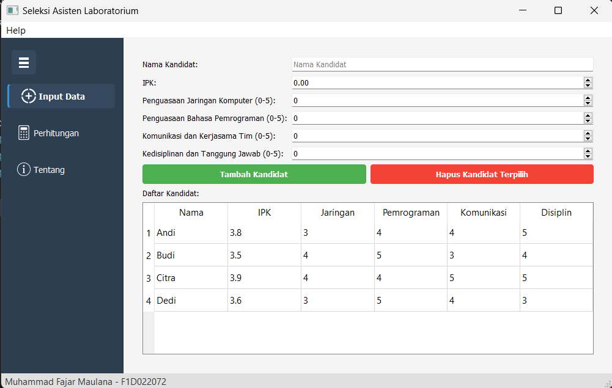
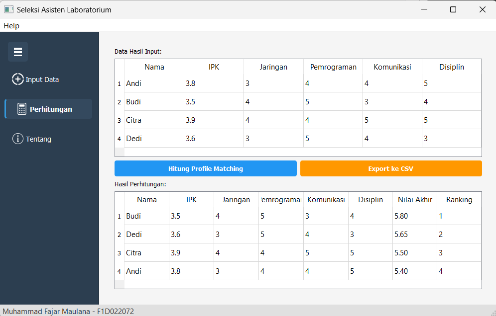
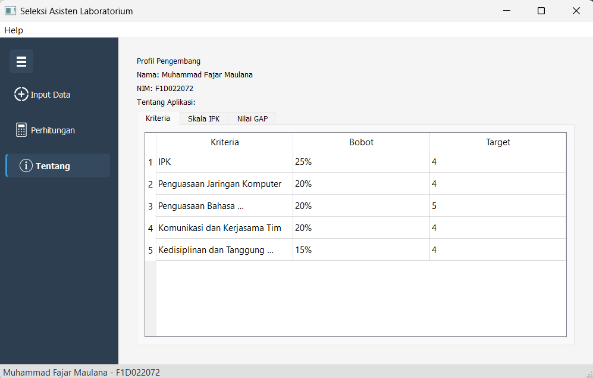
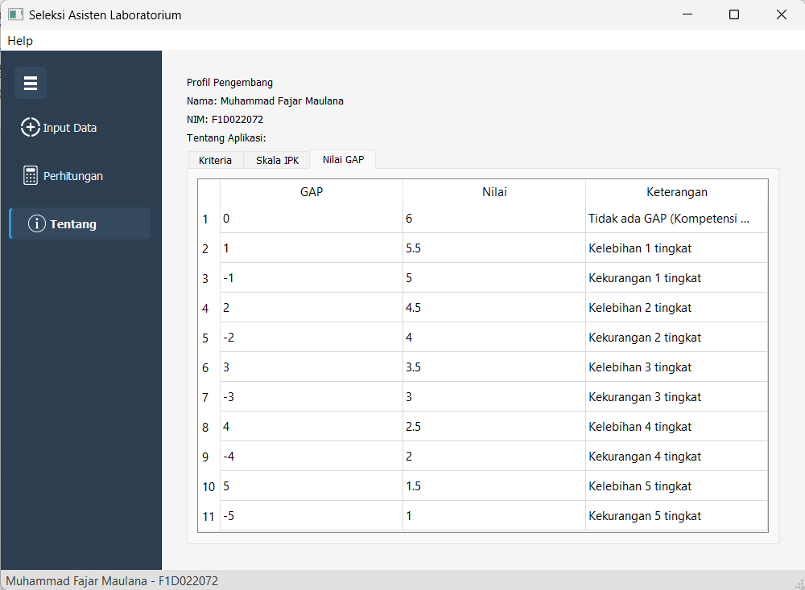

# pv25-finalproject-DSS-Lab-Assistants

Aplikasi ini merupakan sistem seleksi asisten laboratorium yang dibangun menggunakan PyQt5 dengan metode Profile Matching. Program ini memungkinkan pengguna terutama dosen mata kuliah untuk menginput data kandidat meliputi IPK, penguasaan jaringan komputer, kemampuan pemrograman, komunikasi tim, serta kedisiplinan. Data disimpan dalam database SQLite lokal dan melalui algoritma khusus, aplikasi mampu menghitung nilai akhir setiap kandidat beserta peringkatnya.  

Fitur utama meliputi:  
1. Antarmuka dengan navigasi sidebar yang bisa di-expand/collapse  
2. Validasi input data kandidat  
3. Perhitungan otomatis menggunakan metode Profile Matching  
4. Ekspor hasil seleksi ke format CSV  
5. Tampilan informasi kriteria seleksi dan skala penilaian  

Berikut tampilan antarmuka aplikasi:  

  
*Gambar 1: Tampilan input data*  

  
*Gambar 2: Tampilan tampilan perhitungan*  

  
*Gambar 3: Tampilan about dan keterangan kriteria*  

  
*Gambar 4: Tampilan about dan keterangan konversi skala ipk* 

  
*Gambar 5: Tampilan about dan keterangan nilai GAP* 